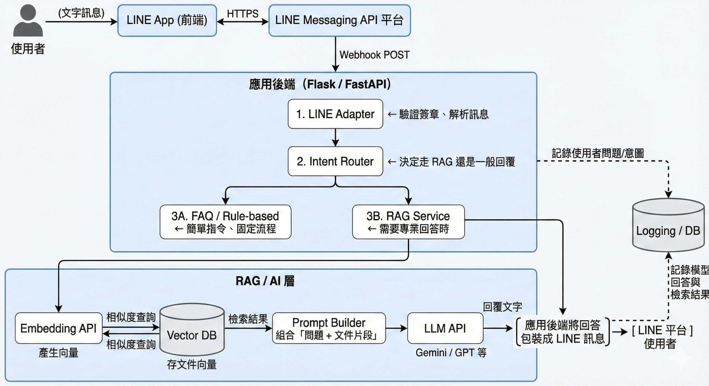
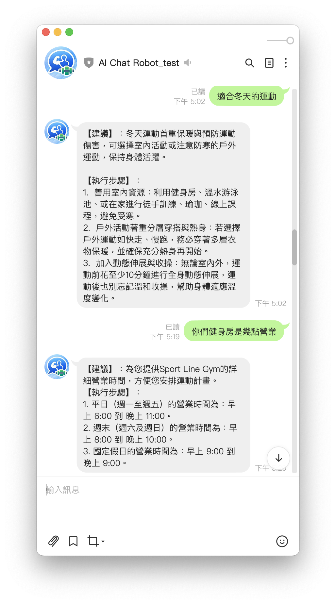

# sport-line-gemini-bot_RAG

# AI 對話機器人程式架構
> **「LINE → Flask 後端 → RAG 知識庫 → Gemini 大腦 → 回傳 LINE」**

---

## #1 整體架構概念

想成一個「健身房櫃檯 AI 助理」：

* **前台**：LINE 使用者
* **大門**：LINE Webhook → Flask `/callback`
* **中控室**：`app.py`（對話邏輯）
* **資料室**：ChromaDB（向量資料庫）
* **大腦**：Gemini 文字模型 + Embedding 模型
* **資料工程師工具**：`ingest_data.py`（建 RAG）、`test_rag_local.py`（測試 RAG）

### ▶ 整體流程圖

```
LINE 使用者 → LINE 平台 Webhook → Flask /callback
     → 解析訊息 (user_text)
     → query_db() 從 ChromaDB 搜尋相關知識
     → 組合 system prompt + context + user_text
     → Gemini 模型生成回答
     → 回傳回答給 LINE 使用者
```

---

## #2 app.py：後端主程式（整個系統的大腦中樞）

### ▶ 1. Flask + LINE Webhook：負責接收事件

* LINE 使用者傳訊息 → LINE 官方伺服器
* Webhook POST 到 `/callback`
* Flask：

  * 驗證簽章
  * 解析訊息、使用者 ID
  * 把訊息交給 AI 核心邏輯
  * 用 `LineBotApi.reply_message()` 回傳內容

> *就是把使用者訊息轉給 AI，再把結果送回 LINE。*

---

### ▶ 2. ask_gemini_sport_assistant：最核心的 AI 對話控制器

負責：

#### (1) 讀取使用者 profile

例如：性別、身高、體重、健身目標
→ 用於個人化回答
例如：「根據你 175/70kg，若你的目標是體脂下降…」

#### (2) 呼叫 RAG → `query_db(user_text)`

* 去 ChromaDB 找與使用者問題最相關的資料
* 把這幾段文件合成 `context_str`

#### (3) 組成 System Prompt（定義 AI 個性）

內含：

* AI 的角色設定（健身教練 + 櫃台客服）
* 回覆語言：繁體中文
* 遵循 RAG 參考資料回答
* 沒資料時的 fallback（健身訓練與飲食建議的固定格式）

#### (4) 呼叫 Gemini 模型

將：

* 系統提示
* 查到的參考資料
* 使用者問題

一起丟到 Gemini，取得回答。

#### (5) 回傳結果給 LINE

用 line-bot-sdk 回覆訊息。

---

## #3 RAG 向量資料庫：rag_utils.py + ChromaDB

### ▶ RAG 的基本精神

> **「問問題 → 找相似文件 → 把文件提供給模型 → 讓模型根據資料回答」**

---

### ▶ 1. GeminiEmbeddingFunction：讓文字變成數學向量

```python
class GeminiEmbeddingFunction(embedding_functions.EmbeddingFunction):
    def __init__(self, api_key):
        self.client = genai.Client(api_key=api_key)

    def __call__(self, input: list[str]) -> list[list[float]]:
        return [self.client.embed(content=x) ... ]
```

用途：

* 把一段文字 transform 成向量 `[0.12, -0.42, …]`
* 相似主題會在靠近的位置

---

### ▶ 2. get_db_collection：取得向量資料庫

建立 / 連線 ChromaDB（永續儲存）：

```python
client = chromadb.PersistentClient(path="./chroma_db")
collection = client.get_or_create_collection(
    name="sports_knowledge",
    embedding_function=gemini_ef
)
```

---

### ▶ 3. add_documents：把文件寫入 ChromaDB

```python
collection.add(
    documents=documents,
    metadatas=metadatas,
    ids=ids
)
```

* documents：分段後的文字內容
* metadatas：來源資訊
* ids：唯一 ID

---

### ▶ 4. query_db：查詢 ChromaDB

```python
results = collection.query(
    query_texts=[query_text],
    n_results=3
)
```

* 用 embedding 比對，找最接近的文件
* 回傳最相關的前 3 段
* 用於 RAG context

---

## #4 資料建置工具：ingest_data.py + gym_info.txt

### ▶ 1. gym_info.txt：知識來源（健身房的官方資料）

包含：

* 營業時間
* 課程費用
* 私訓 / 團課資訊
* 營養諮詢方式
* 注意事項
* 地址、交通方式
* 其他對外說明文件

所有 RAG 都從這個檔案而來。

---

### ▶ 2. ingest_data.py：建立 RAG 知識庫

它會：

1. 掃描 `./data` 資料夾的 `.txt` 文件
2. 將每個 txt 分成多個小 chunk
3. 產生 metadata + id
4. 呼叫 `add_documents()` 寫入 ChromaDB

**開發流程：**

```
放好 gym_info.txt → 執行 ingest_data.py → 建立向量資料庫
```

之後 app.py 就能使用。

---

## #5 本地測試工具：test_rag_local.py

用途：

* **不經 LINE**
* 在電腦直接測試 RAG + Gemini 是否正常
* 模擬使用者提問
  例如：「平日幾點開？」
* 檢查回答是否包含正確資訊（例如 6:00、23:00）

流程：

```python
question = "健身房平日幾點開？"
answer = ask_gemini_sport_assistant(question, fake_profile)
print(answer)
```

---

## #6 完整對話流程

1. 使用者在 **LINE** 問：「週末幾點開？」
2. LINE 把這個訊息丟到 **Flask `/callback`**。
3. Flask 把文字丟給 `ask_gemini_sport_assistant()`。
4. 這個函式：

   * (a) 讀取使用者 profile
   * (b) 使用 `query_db()` 去 ChromaDB 找「週末營業時間」那段文字
   * (c) 把它包成參考資料
   * (d) 加上系統提示（角色 = 健身房客服）
   * (e) 丟給 Gemini 模型產生回答
5. Gemini 回覆：「我們週末 08:00–21:00 營業喔！」
6. Flask 再把回答送回 LINE → 顯示在使用者手機上。


